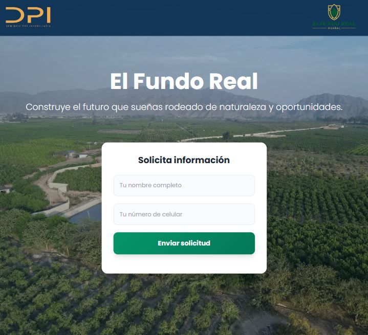

# 🏡 El Fundo Real - Landing Page



Landing page promocional para el proyecto inmobiliario **El Fundo Real**, desarrollada con tecnologías modernas para captar leads y ofrecer una experiencia visual atractiva y optimizada.

## ✨ Características

- **🎨 Diseño Moderno**: Interfaz limpia y profesional con Tailwind CSS
- **📱 Totalmente Responsive**: Optimizado para todos los dispositivos
- **⚡ Alto Rendimiento**: Imágenes optimizadas y carga rápida
- **📧 Captura de Leads**: Formulario integrado con Getform.io
- **🎥 Testimonios Reales**: Videos de clientes en formato vertical
- **🔗 Integración WhatsApp**: Conexión directa con grupo oficial

## 🛠 Tecnologías Utilizadas

- **Frontend**: HTML5, Tailwind CSS, JavaScript
- **Framework CSS**: TailwindCSS (CDN)
- **Fuentes**: Poppins (Google Fonts)
- **Iconos**: Material Icons
- **Formularios**: Getform.io
- **Optimización**: WebP, Lazy Loading, Compresión

## 🚀 Estructura del Proyecto

```

el-fundo-real/
│
├── index.html # Landing page principal
├── gracias.html # Página de agradecimiento
├── assets/
│ ├── images/
│ │ ├── LOGO-DPI.webp
│ │ ├── LOGO-FUNDO-REAL.png
│ │ ├── imagen-1.webp
│ │ ├── imagen-2.webp
│ │ ├── imagen-3.webp
│ │ ├── imagen-4.webp
│ │ ├── mascara-\*.webp
│ │ └── Presentacion.JPG
│ ├── videos/
│ │ ├── testimonio-enrique.mp4
│ │ ├── testimonio-patricia.mp4
│ │ └── testimonio-veronica.mp4
│ └── js/
│ └── form.js # Validación y envío de formulario
└── README.md

```

## 🎯 Secciones Implementadas

1. **🏠 Hero Section** - Presentación principal con formulario de contacto
2. **💡 ¿Por qué elegir un lote campestre?** - 6 beneficios con iconos
3. **🌄 Explora nuestros lotes** - Galería de imágenes responsiva
4. **🎥 Testimonios** - Videos de clientes reales
5. **📞 Footer** - Información de contacto y créditos

## 🚀 Instalación y Uso

1. **Clona el repositorio**:

   ```bash
   git clone https://github.com/tu-usuario/el-fundo-real.git
   ```

2. **Abre el proyecto**:

   ```bash
   cd el-fundo-real
   ```

3. **Servidor local** (opcional):
   ```bash
   python -m http.server 8000
   # Abre http://localhost:8000
   ```

## 🎨 Personalización

### Colores (Tailwind)

- **Principal**: `blue-900` (#0D3153)
- **Secundario**: `green-500` (#059669)
- **Footer**: `gray-800` (#1F2937)

### Fuentes

- **Principal**: Poppins (300, 400, 600, 700)

## 📈 SEO Optimizado

- Meta tags descriptivos
- Estructura semántica HTML5
- Imágenes con alt text optimizado
- Schema markup listo para implementar

## 📄 Licencia

Este proyecto es propiedad de **Dominick Pro Inmobiliaria**.

## 👥 Desarrollado por

**MindDev** - [www.minddevperu.com](https://www.minddevperu.com)

---

<div align="center">

**¿Interesado en lotes campestres?**
[🌐 Visita nuestro sitio](https://dominickpro.com) • [📱 Únete a WhatsApp](https://chat.whatsapp.com/TU_CODIGO_GRUPO)

</div>
